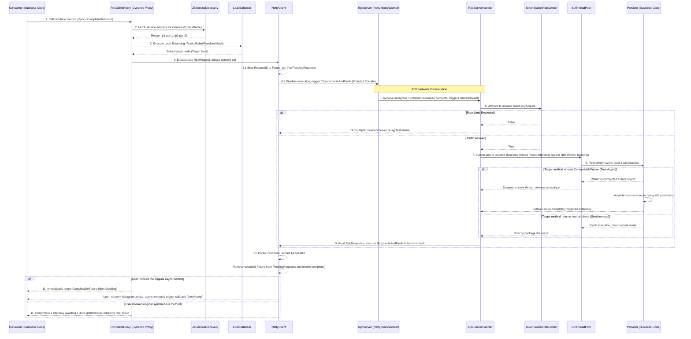

# Core Logic Deep Dive

[中文文档](../zh/core_logic_zh.md)

This document focuses on analyzing the core execution mechanisms of Netty-RPC. As a production-grade, high-performance RPC framework, we will delve into the dynamic proxy scheduling of the client, asynchronous non-blocking execution on the server side, the fully reactive Future mapping mechanism, and the server-side Token Bucket rate-limiting model.

---

## 1. Global Architecture of the Core Pipeline

First, let's review through a comprehensive panorama how a complete RPC request flows from the caller, traverses the network proxies, reaches the server-side business thread pool, and eventually returns the result synchronously or asynchronously.



---

## 2. Source-code Level Flow Disassembly

### 2.1 Dynamic Proxy and Retry Scheduling (`RpcClientProxy`)

When you write injection code using annotations like `@RpcReference(retries = 3)`, Spring essentially assigns a proxy object dynamically generated based on `Proxy.newProxyInstance()` to the field.

Every method invocation on this object intersects with the following logic:

1. **Method Return Type Probe**: Immediately identifies the return type of the called method. `boolean isAsync = CompletableFuture.class.isAssignableFrom(method.getReturnType());`
2. **Fault Tolerance Wrapper**: Enters a `while(tryCount < maxTries)` retry loop. This ensures that transient network jitter causing `RpcException` won't immediately crash user logic, enabling resilient silent-healing mechanisms at the framework floor.
3. **Async Dispatching**: For async execution, the proxy circumvents invoking `Future.get(timeout)` and orchestrates subsequent retry hops on errors via `whenComplete` chaining (i.e. recursively wrapping `sendAsyncWithRetry` while keeping the original outmost Future bound).
4. **Synchronous Deliverance**: For traditional synchronous routines, the proxy transforms into a "blocking gateway" employing `get(timeoutMs, TimeUnit.MILLISECONDS)`, abstracting the cross-internet transaction latency seamlessly from the user application.

### 2.2 Metadata-Driven Registration and Routing with ZooKeeper

Metadata addressing among components enforces strong consistency ZNode interaction utilizing the `Curator` API framework:

```mermaid
graph TD
    A[Provider Service Boots] -->|Registers Service| B(/netty-rpc/services/{InterfaceName})
    B -->|Creates Ephemeral Node| C[IP1:Port1]
    B -->|Creates Ephemeral Node| D[IP2:Port2]
    
    E[Consumer Accesses Proxy] -->|Discovers Interface List| B
    B -->|Pulls All Child IPs| E
    
    F((ZK Session Timeout))-.->|Triggers node crash sensing| C
    F -->|Removes Orphan Nodes Automatically| B
    
    E -->|Second Discovery Fetch| B
    B -->|Returns Only Surviving Entities| D
```
During server registration, it assures that the parent node (named following the absolute Interface class signature) presides as a **PERSISTENT** node. Following this, **EPHEMERAL** nodes, stamped with the active listener's IP and port, spawn beneath the parent hierarchy. This classic paradigm capitalizes upon ZK sessions holding heartbeats, naturally cultivating an ecosystem allowing dynamic provider cluster scale-in or scale-out (health checking).

### 2.3 Reactor Thread Moat: Business Thread Isolation Protocol (`RpcServerHandler`)

If all payload handling encompassing network I/O were to process under the Netty Worker Thread Group (usually equal to CPU cores * 2), situations such as remote database deadlocks or slow remote RPC resolutions would arise drastically:

`Business Blocked -> Worker Thread Halted -> Thousands of TCP channels under this Worker concurrently paralyze read and write ability -> Netty Total Breakdown` 

To combat this "Reactor Anti-pattern", upon inbound datagram reception transferring to `RpcServerHandler`, we institute a firm protocol:
```java
// Reflection logic is offloaded to a non-Netty thread pool
bizThreadPool.submit(() -> {
    ...
    Object result = invokeService(request);
});
```
We actively offload reflection mechanics to a segregated overarching **Business Thread Pool (`bizThreadPool`)**. Even under intensive concurrency spikes logging heavy enterprise executions within the worker queue, client communication channels remaining tethered via heartbeats and subsequent short request network conduits endure without impediment.

### 2.4 High-performance Lock-free TokenBucket Rate Limiter

To guard backend architecture against traffic floods, a single-node Token Bucket-based `RateLimiter` module was developed as an interceptor. 

Algorithmic Core: Injecting a steady threshold of tokens into our validation bucket matching a sustained rate. Since allocating independent scheduled daemon tasks explicitly pushing tokens every millisecond possesses an impractical computational cost during scaled deployment, we leveraged a **Lazy Refill Computation Pipeline**:
```java
private void refill() {
    long now = System.currentTimeMillis();
    if (now > lastRefillTimestamp) {
        long generatedTokens = (now - lastRefillTimestamp) * rate / 1000;
        if (generatedTokens > 0) {
            tokens = (int) Math.min(capacity, tokens + generatedTokens);
            lastRefillTimestamp = now;
        }
    }
}
```
Whenever incoming traffic crosses this execution intercept, the architecture implicitly gauges the timestamp differential mapped against its prior refill occurrence. By directly computing the quotient using the assigned rate configuration, tokens hypothetically amassed over this unbridled period are instantly validated, appended (up to capacity bounds), and debited seamlessly block-free. This approach presents remarkably performant, elegant execution dynamics.

### 2.5 The Pinnacle of Non-Blocking: CompletableFuture Server Integration

Lying between the rate limiter blockade and the business thread pool dispatch resides visually the most momentous reactive revamp inside the engine core:

```mermaid
graph LR
    A[RpcServerHandler] -->|Reflective Call| B(HelloServiceImpl)
    B -->|Yields| C{{CompletableFuture.completedFuture(...)}}
    C -->|instanceof Checks Type Future| D[Registers whenComplete Callback Hook]
    D -.->|Suspends Execution & Releases Thread Instantly| E(Framework Relinquishes Thread Compute)
    C -->|Later Completed by external I/O Threads| F[Triggers Netty writeAndFlush Dispatch]
```

This constructs bilateral reactive architecture:
* Calling clients aren’t forced to wait unproductively, rather allocating networking hooks returning processing rights to enterprise code layers via Futures.
* Business provider routines yielding a backend-originated `CompletableFuture` (perhaps triggered by asynchronous JDBC driver / reactive Redis access) halt their thread computations natively. The `RpcServerHandler` captures and assigns a watcher. The engine manifests theoretically **Zero Thread Blocking Bottlenecks** extending edge-to-edge from request initiation endpoints entirely onto termination processing instances.
