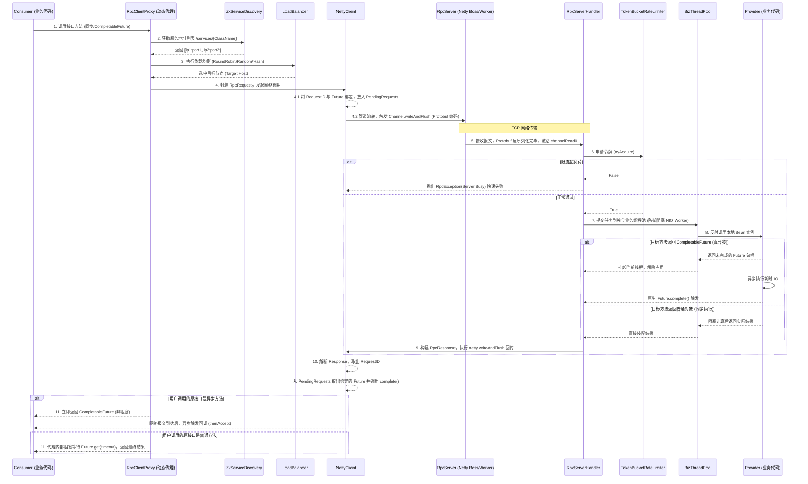
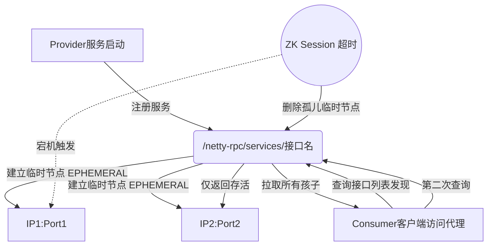
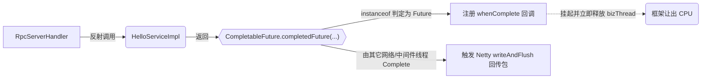

# 核心逻辑深度解析

[English Document](../en/core_logic.md)

本文档专注于剖析 Netty-RPC 的核心流转机制。作为一款生产级别的高性能 RPC 框架，我们将重点探讨客户端的动态代理调度、服务端的异步非阻塞执行、全链路的响应式 Future 映射机制，以及服务端的令牌限流模型。

---

## 1. 核心链路全局架构

首先，我们通过一幅全景图回顾一次完整的 RPC 请求是如何从调用方发起，穿越网络代理，到达服务端业务线程池，最终异/同步返回结果的整个宏观链路。



---

## 2. 核心源码级流程拆解

### 2.1 动态代理与重试调度 (`RpcClientProxy`)

当我们编写类似于 `@RpcReference(retries = 3)` 的注入代码后，Spring 实则会将一个基于 `Proxy.newProxyInstance()` 动态生成的假对象赋予该字段。

每次调用该对象的方法，都会经过以下逻辑拦截：

1. **方法类型探针**：第一时间识别被调用方法的返回类型。`boolean isAsync = CompletableFuture.class.isAssignableFrom(method.getReturnType());`
2. **容错机制包裹**：进入 `while(tryCount < maxTries)` 重试循环池。这确保了因瞬时网络抖动引发的 `RpcException` 不会直接击穿用户逻辑，而在框架底层默默自愈。
3. **请求投递 (Async)**：如果是异步执行，代理不调用 `Future.get(timeout)`，而通过 `whenComplete` 编排后续发生错误时引发的重试跳转（即通过递归 `sendAsyncWithRetry` 并桥接最初那把 Future 钥匙）。
4. **请求投递 (Sync)**：对于传统同步接口，代理通过 `get(timeoutMs, TimeUnit.MILLISECONDS)` 化身"阻塞网关"，使得用户感受不到这段跨越公网的远程旅行。

### 2.2 Zookeeper 的元数据驱动注册与路由

组件间的元数据寻址通过 `Curator` API 进行强一致性的 ZNode 交互：


服务端注册时，先保证父节点（按接口全限定名命名）作为**持久节点 (PERSISTENT)**存在。随后在父节点下方创建以当前节点 IP和监听端口为名额的**瞬时节点 (EPHEMERAL)**。这种极为经典的设计，借助 ZK Session 维持心跳的特性，天然实现了服务端集群节点上下线的动态感知 (Health Checking)。

### 2.3 Reactor 线程护城河：业务线程分离策略 (`RpcServerHandler`)

如果所有网络请求的处理都在处理网络 I/O 事件的 Netty Worker 线程组 (通常等同于核心数*2) 内执行完毕，一旦遇到数据库死锁或远端 RPC 慢查询：

`业务代码阻塞 -> Worker线程卡死 -> 该Worker负责的上千个TCP连接全部假死无法读写网络报文 -> Netty 全面瘫痪`

为了解决这个"Reactor反模式"噩梦，服务器通道事件到达 `RpcServerHandler` 处理层时，我们制定了硬性规约：
```java
// 反射逻辑不再由 channelRead0 目前依赖的线程执行
bizThreadPool.submit(() -> {
    ...
    Object result = invokeService(request);
});
```
我们将业务反射投递给了全局独立的**业务线程池 (`bizThreadPool`)**。使得高并发下尽管耗时业务积压在线程池队列中，但是所有客户端维持心跳与发送小请求的网络链路均处于畅通无阻状态。

### 2.4 TokenBucket 高性能无锁限流器

为保护后端应用，我们引入了基于单节点令牌桶 (Token Bucket) 的 `RateLimiter` 扩展。

算法核心：以恒定速率 `rate` "匀速滴入"计算好的配额池。但在 Java 实现中，如果使用单独起一个定时任务每秒钟去加令牌由于调度毛刺成本太高，我们使用的是**惰性水滴计算流（Lazy Refill）**：
```java
private void refill() {
    long now = System.currentTimeMillis();
    if (now > lastRefillTimestamp) {
        long generatedTokens = (now - lastRefillTimestamp) * rate / 1000;
        if (generatedTokens > 0) {
            tokens = (int) Math.min(capacity, tokens + generatedTokens);
            lastRefillTimestamp = now;
        }
    }
}
```
当流量经过该请求入口时，系统会自动计算 "当前时间" 距离 "上一次产生配额时间" 的差值，瞬间乘上速率推导算出这期间本应下方的积攒令牌，无阻塞完成安全加算并直接扣减，极为高效、优雅。

### 2.5 异步调用：返回 CompletableFuture 的服务端调度

在限流器拦截与业务线程派发之间，存在本次引擎升级最具价值的响应式改造设计：



这构成了双端的响应式：
* 客户端无需等待返回，即可将网络结果钩子交由业务
* 业务服务端通过将 JDBC / Redis 客户端生成的 CompletableFuture 直接向外层返回（Return），无需在业务层执行任何阻塞代码即可被 `RpcServerHandler` 承接异步监听。从调用端到提供端实现了物理意义上 **无一阻塞点**。
